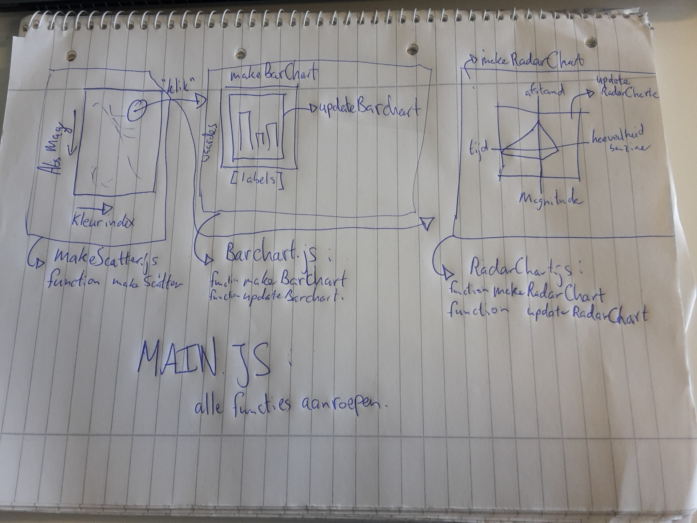

# DESIGN

Data sources:

http://www.astronexus.com/hyg (versie 2)

Aangepast met converter.py

Technical Components:

	- Scatterplot met logaritmische y-as van de absolute magnitude (AbsMag) en lineaire x-as van de kleurindex (ColorIndex) of het type ster (Spectrum).
	  Als er op een ster wordt geklikt dan wordt er een barchart gemaakt.
	- Een barchart met een deel van de overige data en de x en y coordinaten (AbsMag, Colorindex,Spectrum, Velocity).
	  Titel van de barchart is de naam van de ster als deze bekent is, anders de ID van de ster.
	- Radar chart met de afstand, de hoeveelheid benzine, de tijd en de schijnbare magnitude
	- Select knoppen om de type sterren te selecteren
	- Slider om de afstand tot / vanaf waar te selecteren

Scripts / Functies:

	- Scatterplot.js met daarin makeScatter die de scatterplot en alle interactieve elementen maakt. Daarnaast bevat dit script ook een updateScatterplot functie die de scatterplot opnieuw plot als de gebruiker een andere x-as wil
	- Barchart.js met daarin makeBarchart welke de statische aspecten van de barchart maakt, denk hierbij aan de assen, labels etc. Ook zit de updateBarchart in deze file, deze update de barchart als er op een ster is geklikt.
	- RadarChart.js met daarin makeRadarChart die statische aspecten van de radar chart maakt, denk hierbij aan de assen, labels etc. Ook zit de updateRadarChart in deze file, deze update de radar chart als er op een ster is geklikt.
	- een main.js die de functies aanroept en de data inlaadt. De data wordt vervolgens naar de daarvoor bestemde functies doorgestuurd. Als er op een ster wordt geklikt dan wordt de data van die ster doorgestuurd (met behulp van .onclick()) 

Interactieve elementen:

	- Slider waarmee de gebruiker kan kiezen hoeveel sterren er weergegeven worden.
	- X-as kan worden verandert van kleurindex naar type ster
	- De gebruiker kan (als de x-as kleurindex is) ook ervoor kiezen om bepaalde type sterren uit te zetten.

Visualizatie:

Voorlopige external components:

	- d3
	- d3-tip
	- bootstrap
	- queue