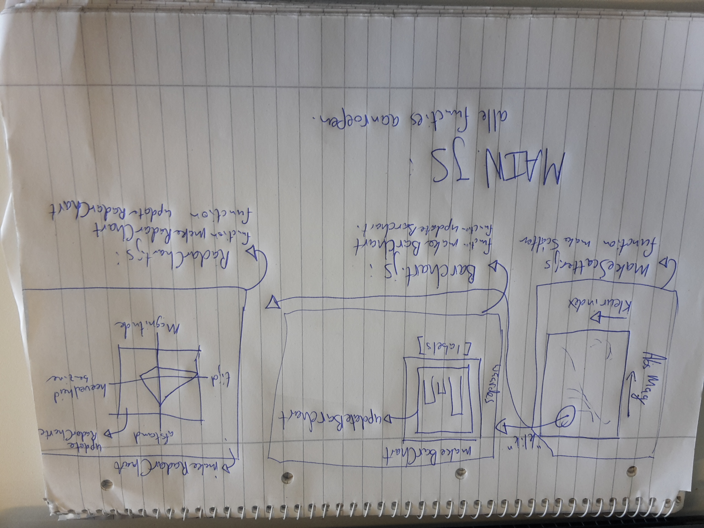

# DESIGN

Data sources:

http://www.astronexus.com/hyg (versie 2)

Aangepast met converter.py

Technical Components:

	- Scatterplot met logaritmische y-as van de absolute magnitude (AbsMag) en lineaire x-as van de kleurindex (ColorIndex).
	  Als er op een ster wordt geklikt dan wordt er een barchart gemaakt.
	- Een barchart met een deel van de overige data en de x en y coordinaten (AbsMag, Colorindex,Spectrum, Velocity).
	  Titel van de barchart is de naam van de ster als deze bekent is, anders de ID van de ster.
	- Radar chart met de afstand, de hoeveelheid benzine, de tijd en de schijnbare magnitude
	- Select knoppen om de type sterren te selecteren
	- Slider om de afstand tot / vanaf waar te selecteren

Scripts / Functies:

	- Scatterplot.js met daarin makeScatter die de scatterplot maakt en alle interactieve elementen maakt. Als er later nog een idee komt voor het veranderen van de assen, zou hier ook een updateScatter komen die  
	- Barchart.js met daarin makeBarchart die statische aspecten van de barchart maakt, denk hierbij aan de assen, labels etc. Ook zit de updateBarchart in deze file, deze update de barchart als er op een ster is geklikt.
	- Radarchart.js met daarin makeRadarChart die statische aspecten van de radar chart maakt, denk hierbij aan de assen, labels etc. Ook zit de updateRadarChart in deze file, deze update de radar chart als er op een ster is geklikt.
	- een main.js die de functies aanroept.

IDEE:

converter opnieuw laten runnen met door gebruiker ingestelde hoeveelheid sterren, afstand

Visualizatie:

External components:

	- d3
	- d3-tip
	- bootstrap
	- queue