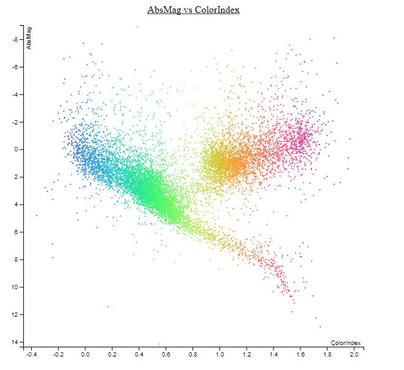
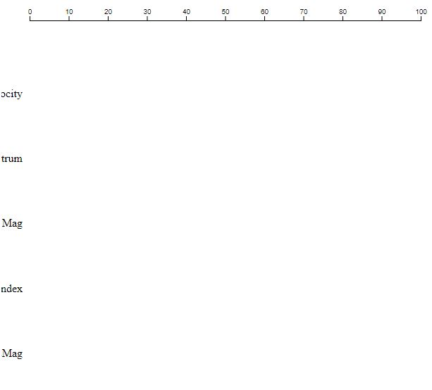
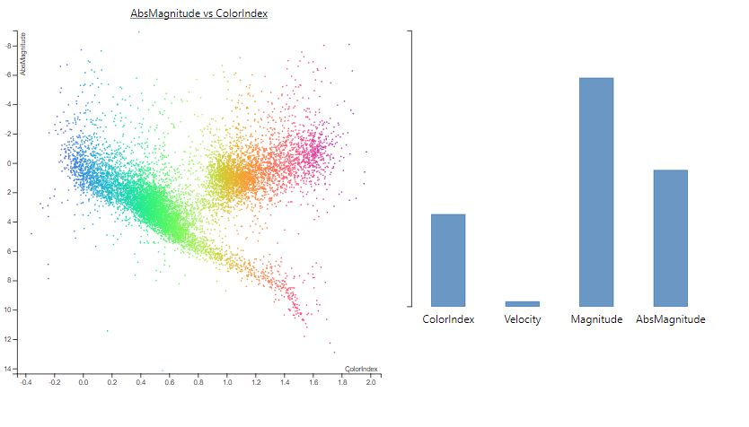

# day 1
## Done
	- Made a scatterplot
	- Added colours to the dots
	- Tried to make the skeleton of the barchart

## To Do
	- Make the barchart
	- Make the radar chart
	- Make them linked to the scatterplot

## Picture of current progress

# day 2

## Done

	-	Bare minimum of the skeleton of the barchart
	-	Linked the barchart to the scatterplot

## To Do
	-	Finalize the barchart
	-	Make the radar chart

# day 3

## Progress
	Sick

# day 4

## Done
	-	Barchart skeleton done
	-	Barchart update nearly done, only needed to prettify

## To Do

	-	Make radar chart
	-	Prettify barchart
	-	Write text

## Picture of current progress

.JPG)

.JPG)

# day 5

## Done
	-	Tooltips working on both the scatterplot and the barchart
	-	Took waaaayyyyy more time than expected
	-	Barchart is pretty

## To Do
	-	Make radar chart
	-	Write text
	-	Make a nice lay out

## Picture of current progress

# day 7

## Done
	-	Wasted too much time trying to make the barchart more pretty
	-	Made the increment lines of the radar chart

## To Do
	-	Finish Radarchart
	-	Write text
	-	Prettify everything

## Picture of current progress

