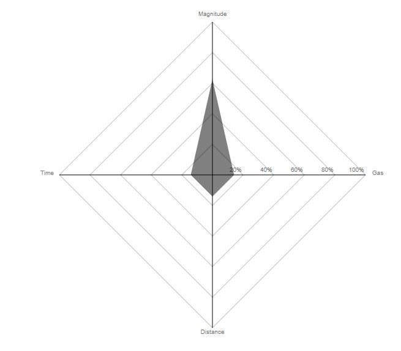
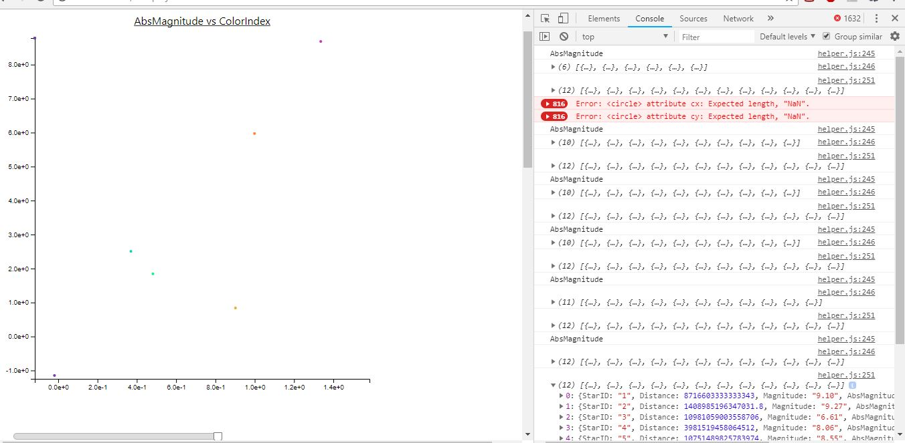
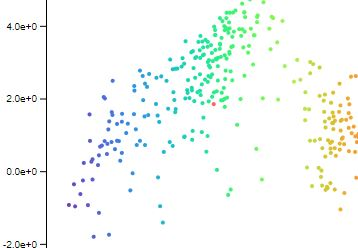
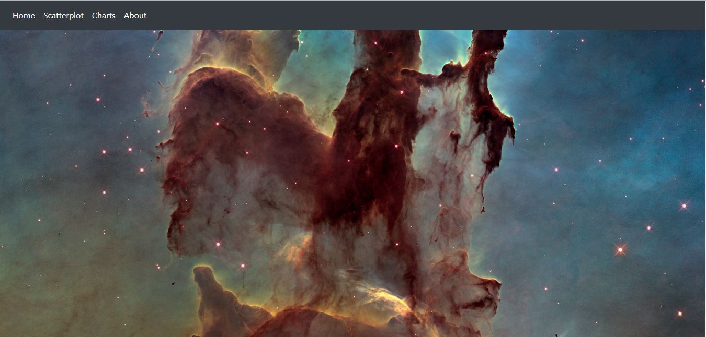
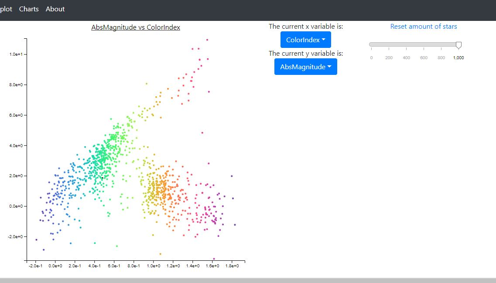
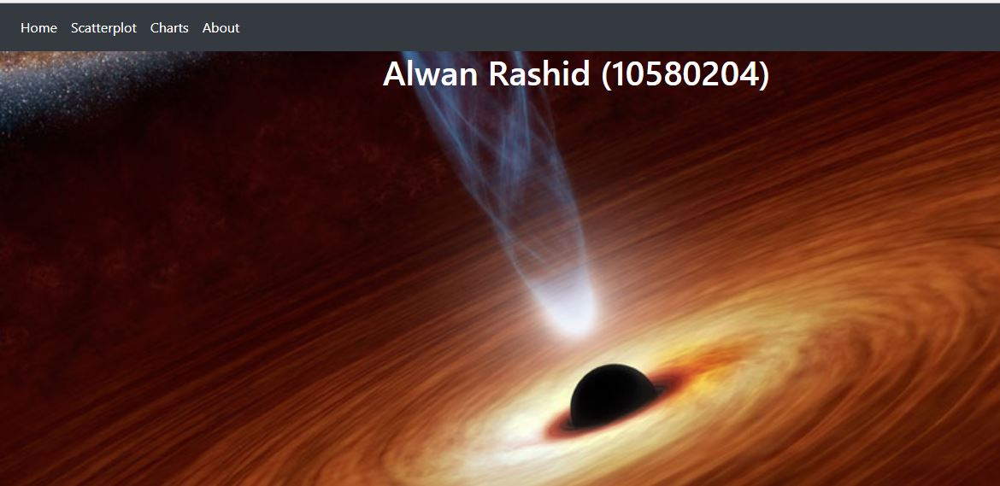

# day 1
## Done
	- Made a scatterplot
	- Added colours to the dots
	- Tried to make the skeleton of the barchart

## To Do
	- Make the barchart
	- Make the radar chart
	- Make them linked to the scatterplot

## Picture of current progress

# day 2

## Done

	-	Bare minimum of the skeleton of the barchart
	-	Linked the barchart to the scatterplot

## To Do
	-	Finalize the barchart
	-	Make the radar chart

# day 3

## Progress
	Sick

# day 4

## Done
	-	Barchart skeleton done
	-	Barchart update nearly done, only needed to prettify

## To Do

	-	Make radar chart
	-	Prettify barchart
	-	Write text

## Picture of current progress

.JPG)

.JPG)

# day 5

## Done
	-	Tooltips working on both the scatterplot and the barchart
	-	Took waaaayyyyy more time than expected
	-	Barchart is pretty

## To Do
	-	Make radar chart
	-	Write text
	-	Make a nice lay out

## Picture of current progress

# day 7

## Done
	-	Wasted too much time trying to make the barchart more pretty
	-	Made the increment lines of the radar chart

## To Do
	-	Finish Radarchart
	-	Write text
	-	Prettify everything

## Picture of current progress

# day 10

## Done
	-	Radarchart done
	-	All visualizations are linked

## To Do
	-	Make x-axis of scatterplot variable
	-	Write text
	-	Prettify everything

## Picture of current progress

# day 11

## Done
	-	Code looks "smooth" and much less is hard coded
	-	Barchart and radar chart are with transitions and tooltips

## To Do
	-	Make x-axis of scatterplot variable
	-	Write text
	-	Prettify lay-out

## Picture of current progress

Picture of code is bit redundant because of github

# day 12

## Done
	-	Dropdown menu, doesn't update

## To Do
	-	Make the dropdown menu update
	-	Write text
	-	Prettify lay-out

## Picture of current progress

# day 13

## Done
	-	Dropdown menu updates 

## To Do
	-	Make the slider function
	-	Write text
	-	Prettify lay-out

# day 14

## Done
	-	The slider functions, but the scatterplot breaks

## To Do
	-	Make the slider function without breaking the scatterplot
	-	Write text
	-	Prettify lay-out

## Picture of current progress

# day 17

## Done
	-	Interactivity done

## To Do
	-	Use proper colour of the stars (same colour as at the start)
	-	Write text
	-	Prettify lay-out

## Picture of current progress

# day 18

## Done
	-	Lay-out done
	-	Barcharts/ Radarchart have the colour of the star in the scatterplot
	-	Scatterplot has proper colours
	-	Navbar working

## To Do
	-	Write text

## Picture of current progress

