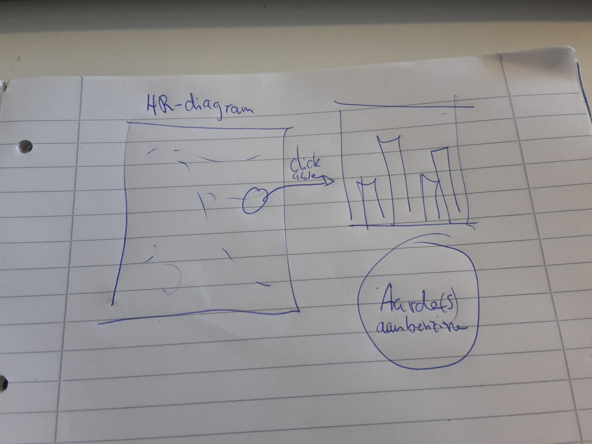

# Eindproject

Alwan Rashid (10580204)

Problem statement:

Deze visualisatie tracht de gebruiker een beter beeld te geven van ontdekte sterren. Het is gericht op mensen die weinig of geen idee hebben hoeveel sterren er zijn en hoe deze zich tot elkaar verhouden.

Solution:

Een scatterplot en als je over een ster hovert dan krijg je de naam mits deze bekend is, anders de ster ID. Als er wordt geklikt op een ster dan wordt er een barchart gemaakt met data (AbsMag, Colorindex,Spectrum,Velocity). Als derde visualizatie wordt een radar chart gemaakt van de afstand tot de ster, de hoeveelheid benzine die een Fiat Panda (0.9TwinAir MT-5 63 kW/85 pk 4X4) nodig heeft om die afstand af te leggen, de tijd die de auto nodig heeft (met 100 km/h)en de (schijnbare) magnitude.
In de scatterplot kan worden gekozen om slechts bepaalde type sterren te laten zien. Ook kan er worden gekozen om alleen sterren vanaf / tot een bepaalde afstand te laten zien.

Main features:

	- scatterplot (op de y-as de absolute magnitude en de kleurindex of het type ster op de x-as)
	- barchart (de absolute magnitude, kleurindex, type ster en de snelheid)
	- radar chart (afstand, hoeveelheid benzine, tijd, schijnbare magnitude)

Allemaal zijn mvp

Visualitatie:

Dataset:

http://www.astronexus.com/hyg (versie 2)
hoogst waarschijnlijk moet ik de dataset veranderen omdat ik de data graag op mijn manier wil hebben.

External components:

	- d3
	- d3-tip
	- bootstrap
	- queue

Simular:

http://astro.unl.edu/mobile/HRdiagram/HRdiagramStable.html

	Nadelen:

		- Laad geen data van sterren zien

Hardest Parts:

	- Derde visualizatie bedenken
	- Data naar wens omzetten