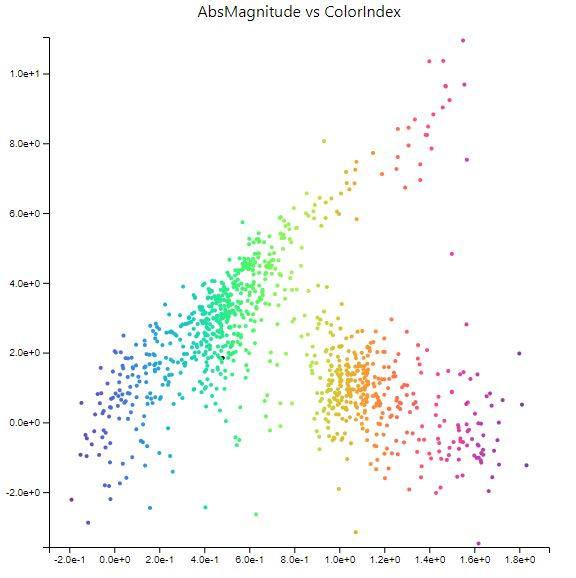
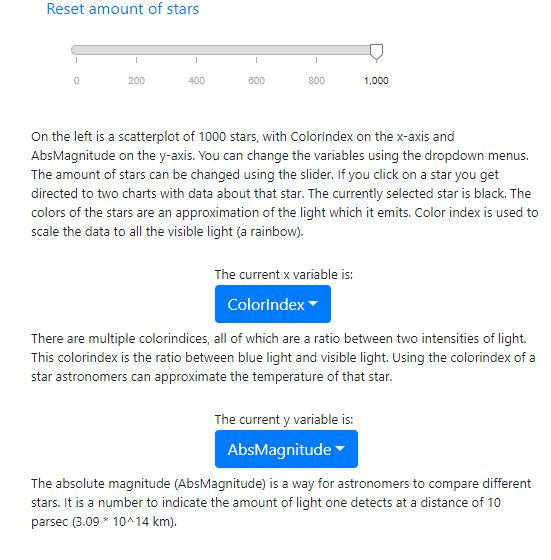
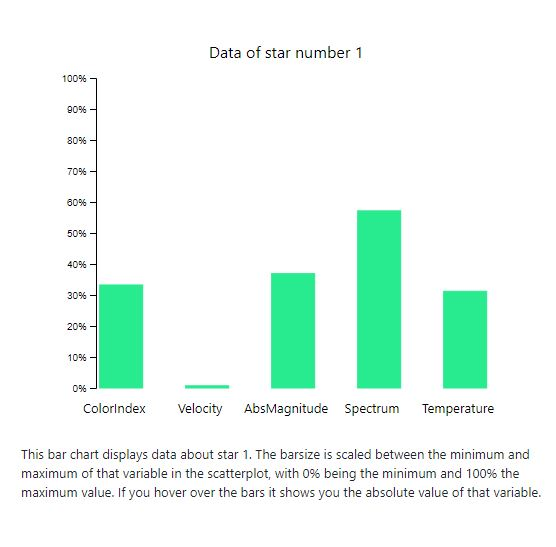
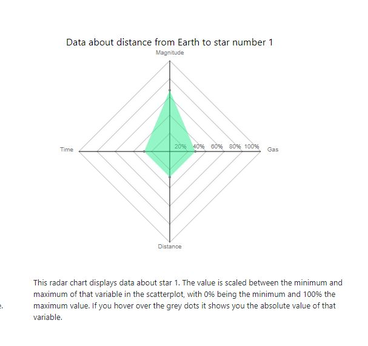

[Finished Site](https://Pietje123.github.io/Eindproject/index.html)

# Eindproject -- Stars

### Alwan Rashid (10580204)
 
The goal of this project is to give people the opportunity to experiment with a few variables of stars and see how those interact with each other and try to give the general public a sense of why astronomical has its meaning.

## The site itself

First of is the scatterplot, every dot represents a star. If you hover over the star, the star gets bigger and a tooltip tells you something about that star. All the stars are clickable and will redirect you to the bar and radar charts. These will display data about that star

Next to the scatterplot are a slider and two dropdownmenus. With the slider you can change the amount of stars which are in the scatterplot. The dropdownmenus are used to change the x- and y-variables.

This bar chart will update if you click on a star and change color according to the color of the star. If you hover above a bar, a tooltip will tell you something about that variable.

This radar chart will update if you click on a star and change color according to the color of the star. If you hover on a dot, a tooltip will tell something about that variable.

Lastly there is the navigation bar, which will redirect you to home, the scatterplot, the charts or the about.

## Used libraries 

[Bootstrap css](https://maxcdn.bootstrapcdn.com/bootstrap/4.0.0/css/bootstrap.min.css)
[Bootstrap js](https://maxcdn.bootstrapcdn.com/bootstrap/4.0.0/js/bootstrap.min.js)
[Dropdown helper](https://cdnjs.cloudflare.com/ajax/libs/popper.js/1.12.9/umd/popper.min.js)
[D3 version 4](https://d3js.org/d3.v4.min.js)
[Slider](https://unpkg.com/d3-simple-slider@0.2.1/build/d3-simple-slider.js)

Copyright © 2018 Alwan Rashid

Everyone is free to use any of the code