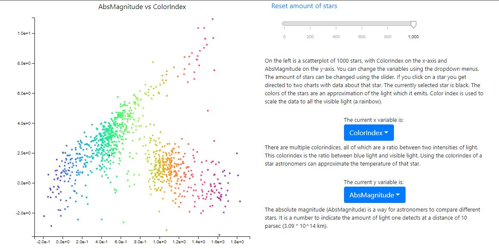

# Report

## Description

The site revolves around a scatterplot, which can be updated by using a slider and dropdownmenus. All the points are clickable and will redirect you to a bar and radar chart which displays data about that point.

## Design

Datascources:
	-	[The stardata](http://www.astronexus.com/hyg) (version 2)

## Site itself

There are 4 sections, each of which fit a screen:
	-	Home, which is just text and an image
	-	About, which also just is text and an image, but also with a datascource
	-	Scatterplot, which is the main visualization of the data
	-	Charts, which visualizes data of one star

The user can navigate through the page using the navigation bar (navbar) or by scrolling:

The navbar works as following:
Like most functions a function (helper/navBarOnClick) is called in the main function (main) and when a button is clicked, this function scrolls to the requested section. The main funciton is called when the data is loaded.

Other important (non helper) functions that are called in main are:
	-	MakeScatter
	-	MakeDropdown
	-	MakeSlider

The function names are self-explanatory, makeScatter (scatter/makeScatter) makes a scatterplot, makeDropdown (dropdown/makeDropdown) make a dropdownmenu and makeSlider (slider/makeSlider) makes a slider. MakeScatter also draws the first points in order to update them using transitions. In makeScatter makeBarchart (barchart/makeBarchart) and makeRadarChart (radarchart/makeRadarChart) are called, which make their respective charts. The scatterplot dots have colors, these are made by using the ColorIndex variable. This gives an indication of the color of the stars. The reason the functions of the charts are called in the scatterplot is because the representation of their data has the same color as the dot in the scatterplot.
The user can update data by:
	-	Clicking on a star which updates the radar and bar chart and colors the clicked star black and the previous selected star its own color. This is done by calling updateBarchart (barchart/updateBarchart), updataRadarChart (radarchart/updateRadarChart) and changeStarColour (helper/changeStarColour)
	-	Using the slider which changes the amount of stars in the scatterplot, This is done by calling sliderUpdateScatterplot (slider/sliderUpdateScatterplot). This function gets a part of the data and adds dummydata in order to keep using the transitions
	-	Using the dropdownmenus which updates the variables of the scatterplot. This is done by calling changeDropdown (dropdown/changeDropdown). This function changes the variables (labels) and checks the slider value.

During this project the most challenging was choosing the subject. Apart from this, correctly displaying the tooltip was also quite challenging. There are a few differences between the original design and the final product. There are no select buttons and the slider changes the amount of stars instead of the distance from / to the stars. The titles of the stars only give the ID of the star and not its propername. Also are all the axes lineair and not logarithmic.

The reason why I chose to change the slider from discriminating on distance to its ID, is because it would have a more continious impact. When the slider is halfway, the scatterplot now has half of the stars, while if it had used the distance maybe it would have sudden spikes in adding or removing stars. The propernames of the data were not the common names, for instance the Suns propername was Sol which propably wouldn't give most people any recognition. Why the axes are all lineair is because the data doesn't really have huge outliner which could be prevented by using logarithmic axes. The select buttons would had needed to change my data too much after I already had made quite a bit of the site, so the idea was abandoned. This could be done if I had more time. 